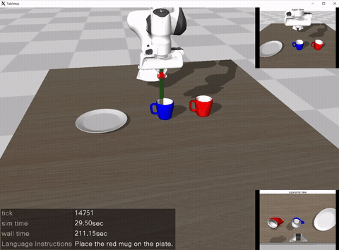
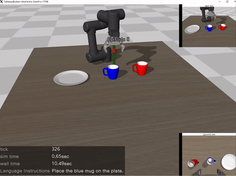
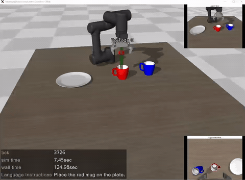

## smolvla_panda_graspe 

本仓库在 [lerobot-mujoco-tutorial](https://github.com/jeongeun980906/lerobot-mujoco-tutorial) 的基础上二次开发：将原项目中的 **UR5** 机械臂替换为 **Franka Panda** 机械臂，并在 Panda 环境下**重新采集演示数据**，完成 **SmolVLA** 的训练与推理部署（inference）流程。




---

## ✨ 主要改动

- ✅ 机器人模型：UR5 → **Franka Panda**
- ✅ Panda 环境与任务适配：动作空间、关节/夹爪控制、初始姿态等
- ✅ 重新采集数据集：`panda_demo_data/`
- ✅ 训练：配置 `smolvla_omy.yaml`
- ✅ 推理：`panda_graspe_inference.py`
- ✅ 数据可视化：`panda_visualize_data.ipynb`
- ✅ 保留 UR5 对照脚本：`ur5_collect.py`、`ur5_graspe_inference.py`

---

## 📁 代码结构

```text
smolvla_panda_graspe/
├── asset/                      # MuJoCo 资源/模型文件
├── ckpt/                       # 训练输出的 checkpoint
├── media/                      # GIF/可视化素材
├── mujoco_env/                 # MuJoCo 环境与任务定义（已适配 Panda）
├── panda_demo_data/            # ✅ Panda 重新采集的数据集
├── panda_collect.py            # ✅ Panda 数据采集脚本
├── panda_graspe_inference.py   # ✅ Panda 推理/部署脚本
├── panda_visualize_data.ipynb  # ✅ Panda 数据可视化
├── train_model.py              # ✅ 训练入口
├── smolvla_omy.yaml            # ✅ 训练配置
├── pi0_omy.yaml                # pi0配置
├── requirements.txt
├── test.py
├── ur5_collect.py              # UR5 对照：采集脚本
└── ur5_graspe_inference.py     # UR5 对照：推理脚本
```
---

## 🧰 Installation

# 1) create env
```bash
conda create -n smolvla_panda python=3.10 -y
conda activate smolvla_panda
```
# 2) install deps
```bash
pip install -r requirements.txt
```

---

## Acknowledgements
- This repository is based on [lerobot-mujoco-tutorial](https://github.com/jeongeun980906/lerobot-mujoco-tutorial).
- The original MuJoCo parser ([mujoco_env/mujoco_parser.py](./mujoco_env/mujoco_parser.py)) is modified from [yet-another-mujoco-tutorial](https://github.com/sjchoi86/yet-another-mujoco-tutorial-v3).
- We refer to the original tutorials and examples from [LeRobot](https://github.com/huggingface/lerobot/tree/main/examples).
- The assets for the plate and mug are from [Objaverse](https://objaverse.allenai.org/).
