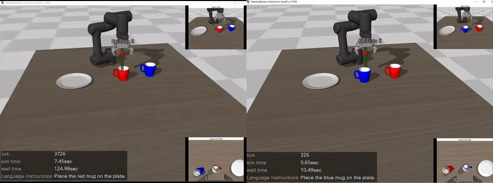

## smolvla_panda_graspe 

本仓库在 [lerobot-mujoco-tutorial](https://github.com/jeongeun980906/lerobot-mujoco-tutorial) 的基础上二次开发：将原项目中的 **UR5** 机械臂替换为 **Franka Panda** ，设置**随机杯子位置**，并在 Panda 环境下**重新采集演示数据**，完成 **SmolVLA** 的训练与推理部署（inference）流程。

---

## Acknowledgements
- This repository is based on [lerobot-mujoco-tutorial](https://github.com/jeongeun980906/lerobot-mujoco-tutorial).
- The original MuJoCo parser ([mujoco_env/mujoco_parser.py](./mujoco_env/mujoco_parser.py)) is modified from [yet-another-mujoco-tutorial](https://github.com/sjchoi86/yet-another-mujoco-tutorial-v3).
- We refer to the original tutorials and examples from [LeRobot](https://github.com/huggingface/lerobot/tree/main/examples).
- The assets for the plate and mug are from [Objaverse](https://objaverse.allenai.org/).
